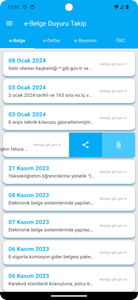

# e-Belge Duyuru Takip Uygulaması

**Ana Özellikler:**
- e-Belge, e-Defter, e-Beyanname ve OKC duyularını görüntüleyebilirsiniz.
- e-Dönüşüm sürecindeki mevzuat değişiklikleri, sistemsel kesintiler ve önemli gelişmeler için anında bildirim alabilirsiniz.

**Diğer İşlemler:**
- e-Arşiv Fatura Doğrulama (Qr okuma destekli.)
- e-Smm Doğrulama (Qr okuma destekli.)
-  Mükellef Sorgulama (e-Fatura, e-Arşiv, e-İrsaliye, e-SMM ve e-MM)
## Ekran Görüntüleri




## Android Build

#### Android build işlemleri için eklenmesi gereken parametreler:

```http
 Android > local.properties
```

| Parametre | Tip     | Açıklama                |
| :-------- | :------- | :------------------------- |
| `flutter.compileSdkVersion` | `int` | **Gerekli**. Derleme SDK Sürümü |
| `flutter.minSdkVersion` | `int` | **Gerekli**. Min. Derleme SDK Sürümü |
| `flutter.targetSdkVersion` | `int` | **Gerekli**. Hedef Derleme SDK Sürümü |

Example
- flutter.compileSdkVersion=33
- flutter.minSdkVersion=33
- flutter.targetSdkVersion=33

  
## Kullanılan Teknolojiler

**Flutter**

**Database:** Firebase

**Bildirim:** One Signal
  
## İlişkili Projeler


[eBelge_DataSyncHub](https://github.com/developersimsek/eBelge_DataSyncHub)

  
## Yol haritası
- Google Play'de yayınlama.
- App Store'de yayınlama.
- Daha fazla entegrasyon ekleme

  